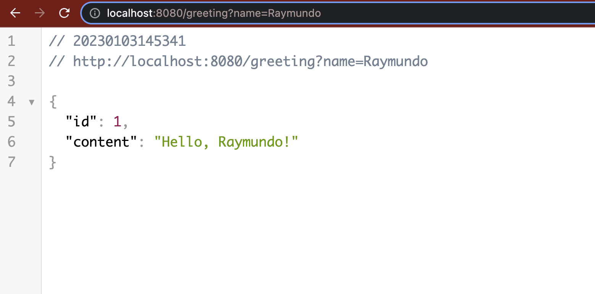
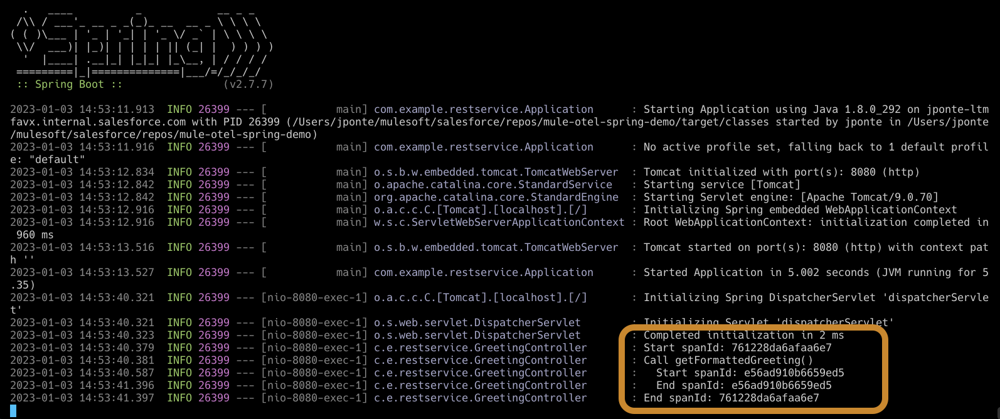
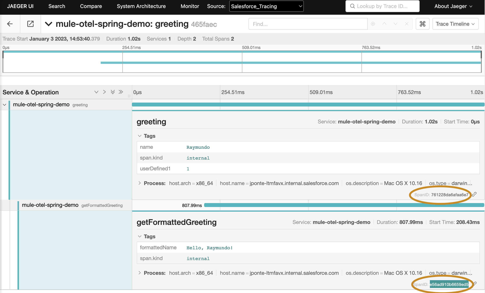

# Open Telemetry Demo with Spring Boot

Demo about implementing Open Telemetry SDK with Spring Boot. This project is a playground for testing how to implement the OTEL SDK with Java. 

# Configuration

The service uses configuration from `Environment Variables`, provide the next variables
```bash
export OTEL_METRICS_EXPORTER=none
export OTEL_EXPORTER_OTLP_ENDPOINT=http:// THE URL OF THE COLLECTOR :4317
export OTEL_TRACES_EXPORTER=otlp
export OTEL_RESOURCE_ATTRIBUTES=service.name=otel-spring-demo
```

Run the service:
```bash
mvn spring-boot:run
```

# Results

Testing the service in a browser:
```bash
http://localhost:8080/greeting?name=Raymundo
```

Browser results:


The output from the java project:


The results in Jager Server:

